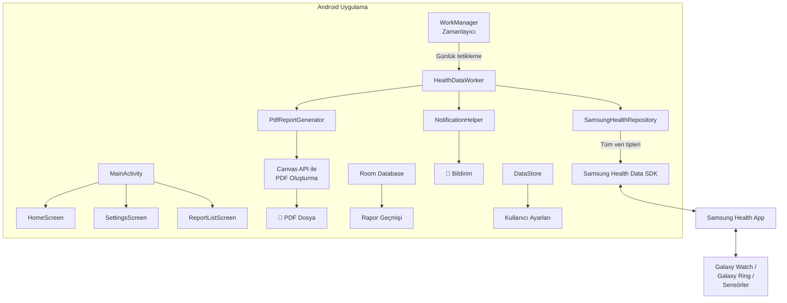
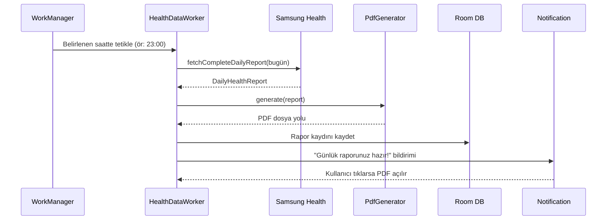

# Samsung Health Günlük PDF Rapor Uygulaması — Kapsamlı Plan

Samsung Health'ten **erişilebilir tüm** sağlık verilerini çekip, günün belirlenen saatinde otomatik PDF rapor oluşturan bir Android uygulaması.

---

## 🔴 SİZİN YAPMANIZ GEREKENLER (Manuel Adımlar)

Aşağıdaki adımlar programatik olarak yapılamaz, sizin tarafınızdan tamamlanmalıdır:

### Geliştirme Öncesi
| # | Görev | Nasıl Yapılır | Zorunlu mu? |
|:--|:------|:-------------|:------------|
| 1 | **Samsung Developer hesabı oluşturun** | [developer.samsung.com](https://developer.samsung.com) adresine gidin ve ücretsiz hesap açın | ✅ Evet |
| 2 | **Samsung Health Data SDK'yı indirin** | Developer Portal → Health → SDK indirme sayfasından `.aar` dosyasını indirin | ✅ Evet |
| 3 | **İndirdiğiniz `.aar` dosyasını proje dizinine kopyalayın** | Dosyayı `app/libs/` klasörüne koyun (klasörü ben oluşturacağım) | ✅ Evet |
| 4 | **Fiziksel Samsung cihazınızda Developer Mode açın** | Samsung Health app → Ayarlar → "Samsung Health Hakkında" → Sürüm numarasına **10 kez** tıklayın → Developer Mode aktif olacak | ✅ Evet (test için) |
| 5 | **Samsung Health uygulamasının güncel olduğundan emin olun** | Play Store'dan Samsung Health'i en az **6.30.2** sürümüne güncelleyin | ✅ Evet |

### Üretim/Dağıtım İçin (Sonra Yapılacak)
| # | Görev | Nasıl Yapılır | Zorunlu mu? |
|:--|:------|:-------------|:------------|
| 6 | **Samsung Partner Request başvurusu** | Developer Portal'dan paket adı + SHA-256 imzası ile başvuru yapın | ⚠️ Sadece Play Store'a yüklemek istersen |
| 7 | **Google Play Console'da izin bildirimi** | Sağlık izinlerini Play Console'da beyan edin | ⚠️ Sadece Play Store'a yüklemek istersen |

> [!TIP]
> **Başlangıç için yalnızca 1-5 numaralı adımları yapmanız yeterlidir.** 6-7 numaralı adımlar uygulamayı Play Store'a yüklemek istediğinizde gerekli olacak.

---

## Çekilecek TÜM Veri Tipleri

Samsung Health Data SDK'nın sunduğu **tüm** veri tipleri aşağıdadır. Hepsini çekmeyi hedefliyoruz:

### 🏃 Aktivite & Hareket
| Veri Tipi | Açıklama | Çekilecek Alanlar |
|:----------|:---------|:-------------------|
| **Adım Sayısı** | Günlük toplam adım | Toplam adım, hedef, mesafe (km), süre |
| **Adım Hedefi** | Günlük adım hedefi | Hedef adım sayısı |
| **Aktif Süre Hedefi** | Günlük aktif dakika hedefi | Hedef dakika |
| **Aktif Kalori Hedefi** | Günlük kalori yakma hedefi | Hedef kalori |
| **Çıkılan Kat** | Merdiven/yokuş katları | Toplam kat, yükseklik değişimi |
| **Aktivite Özeti** | Günlük genel aktivite | Toplam kalori, aktif kalori, dinlenme kalorisi, aktif süre |

### 🏋️ Egzersiz & Antrenmanlar
| Veri Tipi | Açıklama | Çekilecek Alanlar |
|:----------|:---------|:-------------------|
| **Egzersiz Kayıtları** | Tüm antrenman türleri | Tür (koşu/yüzme/bisiklet vb.), süre, mesafe, kalori, ort/max nabız, hız, konum verisi, başlangıç/bitiş zamanı |

### 😴 Uyku & Enerji
| Veri Tipi | Açıklama | Çekilecek Alanlar |
|:----------|:---------|:-------------------|
| **Uyku Verisi** | Detaylı uyku analizi | Toplam süre, uyku skoru/kalitesi, evreler (REM/Hafif/Derin/Uyanık), yatma zamanı, kalkma zamanı |
| **Uyku Hedefi** | Uyku süresi hedefi | Hedef saat |
| **Uyku Apnesi** | Uyku apne tespiti | Apne seviyesi, olay sayısı |
| **Enerji Skoru** | Günlük fiziksel/mental hazırlık | Skor (0-100), uyku/aktivite/nabız bazlı analiz |

### ❤️ Kalp & Vital Değerler
| Veri Tipi | Açıklama | Çekilecek Alanlar |
|:----------|:---------|:-------------------|
| **Nabız** | Kalp atış hızı | Ortalama, min, max, dinlenme nabzı, ölçüm zamanları |
| **Kan Basıncı** | Tansiyon ölçümleri | Sistolik, diastolik, nabız, ölçüm zamanı |
| **Kan Oksijeni (SpO2)** | Oksijen saturasyonu | SpO2 yüzdesi, ölçüm zamanı |
| **Kan Şekeri** | Glikoz seviyesi | Glikoz değeri (mg/dL), ölçüm zamanı, öğün durumu |
| **Cilt Sıcaklığı** | Cilt yüzey sıcaklığı | Sıcaklık (°C), ölçüm zamanı |
| **Düzensiz Kalp Ritmi** | Aritmi bildirimleri | Tespit zamanı, sonuç |

### 🍎 Vücut & Beslenme
| Veri Tipi | Açıklama | Çekilecek Alanlar |
|:----------|:---------|:-------------------|
| **Vücut Kompozisyonu** | Vücut ölçümleri | Kilo, boy, BMI, yağ oranı, kas kütlesi, iskelet kası, vücut suyu |
| **Vücut Sıcaklığı** | Vücut iç sıcaklığı | Sıcaklık (°C), ölçüm yeri |
| **Beslenme** | Besin alımı | Kalori, karbonhidrat, protein, yağ, lif, su vb. |
| **Beslenme Hedefi** | Günlük beslenme hedefi | Hedef kalori, makrolar |
| **Su Tüketimi** | Günlük su alımı | Toplam ml, hedef ml |
| **Su Tüketimi Hedefi** | Günlük su hedefi | Hedef ml |

### 👤 Kullanıcı Bilgileri
| Veri Tipi | Açıklama | Çekilecek Alanlar |
|:----------|:---------|:-------------------|
| **Kullanıcı Profili** (salt okunur) | Temel bilgiler | Cinsiyet, doğum tarihi, boy, kilo, takma ad |

> [!NOTE]
> Bazı veriler (kan basıncı, kan şekeri, SpO2 vb.) yalnızca kullanıcı bu verileri Samsung Health'e girdiyse veya uyumlu bir cihaz (Galaxy Watch vb.) kullanıyorsa mevcut olacaktır. Uygulama, mevcut olmayan verileri atlar ve sadece bulunan verileri rapora dahil eder.

---

## Mimari Genel Bakış



---

## Adım Adım Geliştirme Süreci

Geliştirme sürecini **6 aşamaya** böldüm. Her aşamada ne yapılacağını, hangi dosyaların oluşturulacağını ve nasıl test edileceğini detaylı açıklıyorum.

---

### AŞAMA 1: Proje İskeleti & SDK Kurulumu

**Ne yapılacak:** Android projesi oluşturma, Gradle konfigürasyonu, temel klasör yapısı.

**Oluşturulacak dosyalar:**
```
shealt/
├── app/
│   ├── libs/                          ← SİZ: .aar dosyasını buraya koyun
│   ├── src/main/
│   │   ├── AndroidManifest.xml
│   │   ├── java/com/shealt/healthreport/
│   │   │   ├── HealthReportApp.kt     (Application sınıfı)
│   │   │   └── MainActivity.kt
│   │   └── res/
│   │       ├── values/strings.xml
│   │       └── xml/file_paths.xml     (FileProvider için)
│   └── build.gradle.kts
├── build.gradle.kts                   (Project-level)
├── settings.gradle.kts
└── gradle.properties
```

**Manifest izinleri:**
```xml
<uses-permission android:name="android.permission.POST_NOTIFICATIONS"/>
<uses-permission android:name="android.permission.SCHEDULE_EXACT_ALARM"/>
<uses-permission android:name="android.permission.FOREGROUND_SERVICE"/>
<uses-permission android:name="android.permission.FOREGROUND_SERVICE_HEALTH"/>
```

**Doğrulama:** `./gradlew assembleDebug` başarılı derleme.

---

### AŞAMA 2: Veri Modelleri & Repository

**Ne yapılacak:** Tüm sağlık verilerini temsil eden Kotlin data class'ları ve Samsung Health SDK ile veri çekme mantığı.

**Oluşturulacak dosyalar:**

```
data/
├── model/
│   ├── DailyHealthReport.kt        ← Tüm verileri kapsayan ana model
│   ├── SleepData.kt                ← Uyku + uyku kalitesi + evreler
│   ├── EnergyData.kt               ← Enerji skoru
│   ├── HeartRateData.kt            ← Nabız (ort/min/max/dinlenme)
│   ├── StepData.kt                 ← Adım + hedef + mesafe
│   ├── CalorieData.kt              ← Toplam/aktif/dinlenme kalori
│   ├── WorkoutData.kt              ← Antrenman detayları
│   ├── BloodPressureData.kt        ← Tansiyon
│   ├── BloodOxygenData.kt          ← SpO2
│   ├── BloodGlucoseData.kt         ← Kan şekeri
│   ├── BodyCompositionData.kt      ← Vücut ölçümleri
│   ├── NutritionData.kt            ← Beslenme
│   ├── WaterIntakeData.kt          ← Su tüketimi
│   ├── FloorData.kt                ← Çıkılan kat
│   ├── SkinTemperatureData.kt      ← Cilt sıcaklığı
│   └── UserProfileData.kt          ← Kullanıcı profili
├── repository/
│   ├── SamsungHealthRepository.kt   ← Ana veri erişim sınıfı
│   └── HealthPermissionManager.kt   ← İzin yönetimi
```

**Ana Repository yapısı:**
```kotlin
class SamsungHealthRepository(context: Context) {
    private val store = HealthDataService.getStore(context)
    
    // Her veri tipi için ayrı suspend fonksiyon
    suspend fun fetchSleepData(date: LocalDate): SleepData?
    suspend fun fetchEnergyScore(date: LocalDate): EnergyData?
    suspend fun fetchHeartRate(date: LocalDate): HeartRateData?
    suspend fun fetchSteps(date: LocalDate): StepData?
    suspend fun fetchCalories(date: LocalDate): CalorieData?
    suspend fun fetchWorkouts(date: LocalDate): List<WorkoutData>
    suspend fun fetchBloodPressure(date: LocalDate): List<BloodPressureData>
    suspend fun fetchBloodOxygen(date: LocalDate): List<BloodOxygenData>
    suspend fun fetchBloodGlucose(date: LocalDate): List<BloodGlucoseData>
    suspend fun fetchBodyComposition(date: LocalDate): BodyCompositionData?
    suspend fun fetchNutrition(date: LocalDate): NutritionData?
    suspend fun fetchWaterIntake(date: LocalDate): WaterIntakeData?
    suspend fun fetchFloors(date: LocalDate): FloorData?
    suspend fun fetchSkinTemperature(date: LocalDate): List<SkinTemperatureData>
    suspend fun fetchSleepApnea(date: LocalDate): SleepApneaData?
    suspend fun fetchUserProfile(): UserProfileData?
    
    // Tüm verileri tek seferde çeken üst seviye metot
    suspend fun fetchCompleteDailyReport(date: LocalDate): DailyHealthReport {
        return DailyHealthReport(
            date = date,
            sleep = fetchSleepData(date),
            energy = fetchEnergyScore(date),
            heartRate = fetchHeartRate(date),
            steps = fetchSteps(date),
            calories = fetchCalories(date),
            workouts = fetchWorkouts(date),
            bloodPressure = fetchBloodPressure(date),
            bloodOxygen = fetchBloodOxygen(date),
            bloodGlucose = fetchBloodGlucose(date),
            bodyComposition = fetchBodyComposition(date),
            nutrition = fetchNutrition(date),
            waterIntake = fetchWaterIntake(date),
            floors = fetchFloors(date),
            skinTemperature = fetchSkinTemperature(date),
            sleepApnea = fetchSleepApnea(date),
            userProfile = fetchUserProfile()
        )
    }
}
```

**Her veri tipi için okuma mantığı:**
1. `HealthDataResolver.ReadRequest.Builder()` ile sorgu oluştur
2. Tarih aralığı filtresi ekle (`START_TIME`, `END_TIME`)
3. İstenen property'leri belirle
4. `resolver.read(request)` ile veriyi oku
5. Cursor üzerinden verileri parse et → data class'a dönüştür
6. Veri yoksa `null` döndür (hata fırlatma)

**Doğrulama:** Birim testleri + fiziksel cihazda her veri tipi için okuma testi.

---

### AŞAMA 3: PDF Rapor Motoru

**Ne yapılacak:** Android `PdfDocument` API'si ile profesyonel görünümlü, çok sayfalı PDF oluşturma.

**Oluşturulacak dosyalar:**
```
pdf/
├── PdfReportGenerator.kt           ← Ana PDF oluşturucu
├── PdfStyles.kt                    ← Renkler, fontlar, ölçüler
├── PdfPageBuilder.kt               ← Sayfa düzeni yardımcısı
└── PdfSectionRenderers.kt          ← Her bölüm için çizim fonksiyonları
```

**PDF Rapor Yapısı (sayfa düzeni):**

```
┌─────────────────────────────────┐
│  📊 GÜNLÜK SAĞLIK RAPORU        │
│  26 Mayıs 2026, Salı            │
│  Kullanıcı: [İsim]              │
├─────────────────────────────────┤
│                                 │
│  ╔═══════╗ ╔═══════╗ ╔═══════╗ │
│  ║ ⚡ 85  ║ ║ 😴 92 ║ ║ 🚶8.5K║ │
│  ║ Enerji ║ ║ Uyku  ║ ║ Adım  ║ │
│  ╚═══════╝ ╚═══════╝ ╚═══════╝ │
│  ╔═══════╗ ╔═══════╗ ╔═══════╗ │
│  ║ 🔥 2.1K║ ║ ❤️ 72 ║ ║ 🏋️ 2  ║ │
│  ║ Kalori ║ ║ Nabız ║ ║Antren.║ │
│  ╚═══════╝ ╚═══════╝ ╚═══════╝ │
│                                 │
│  ── UYKU ANALİZİ ────────────  │
│  Toplam: 7s 32dk                │
│  Skor: 92/100                   │
│  ████████░░ REM    1s 45dk      │
│  ████████████░ Hafif 3s 12dk    │
│  ██████░░░░ Derin  1s 55dk      │
│  ██░░░░░░░░ Uyanık   40dk      │
│  Yatma: 23:15 → Kalkma: 06:47  │
│                                 │
│  ── NABIZ ────────────────────  │
│  Ortalama: 72 bpm               │
│  Min: 52 bpm  Max: 145 bpm     │
│  Dinlenme: 58 bpm               │
│                                 │
│  ── AKTİVİTE ─────────────────  │
│  Adım: 8,542 / 10,000 hedef    │
│  Mesafe: 6.2 km                 │
│  Kat: 12 kat                    │
│  Aktif Süre: 45 dk              │
│                                 │
│  ── KALORİ ───────────────────  │
│  Toplam: 2,145 kcal             │
│  Aktif: 645 kcal                │
│  Dinlenme: 1,500 kcal           │
├─────── SAYFA 2 ─────────────────┤
│                                 │
│  ── ANTRENMANLAR ─────────────  │
│  ┌──────┬───────┬──────┬─────┐ │
│  │ Tür  │ Süre  │ Kcal │ Nbz │ │
│  ├──────┼───────┼──────┼─────┤ │
│  │ Koşu │ 35 dk │ 320  │ 142 │ │
│  │ Yoga │ 20 dk │  85  │  95 │ │
│  └──────┴───────┴──────┴─────┘ │
│                                 │
│  ── VİTAL DEĞERLER ───────────  │
│  Kan Basıncı: 120/80 mmHg      │
│  SpO2: %98                      │
│  Kan Şekeri: 95 mg/dL          │
│  Cilt Sıcaklığı: 36.5°C        │
│                                 │
│  ── BESLENME ─────────────────  │
│  Kalori: 1,850 / 2,200 hedef   │
│  Protein: 85g | Karb: 220g     │
│  Yağ: 65g | Lif: 28g           │
│  Su: 2.1L / 2.5L hedef         │
│                                 │
│  ── VÜCUT ÖLÇÜMLERİ ─────────  │
│  Kilo: 75.2 kg | BMI: 24.1     │
│  Yağ: %18.5 | Kas: 35.2 kg     │
│                                 │
│  ─────────────────────────────  │
│  Oluşturulma: 26.05.2026 23:00 │
│  ShealtReport v1.0              │
└─────────────────────────────────┘
```

**Teknik detaylar:**
- A4 boyut: 595 x 842 pt
- `Canvas.drawText()`, `drawRect()`, `drawLine()` ile çizim
- Dinamik sayfa ekleme (veri miktarına göre 1-3 sayfa)
- Veri olmayan bölümler otomatik atlanır
- Dosya adı: `saglik_raporu_YYYY-MM-DD.pdf`
- Kayıt yeri: `Documents/ShealtReports/`

**Doğrulama:** Örnek verilerle PDF oluşturup görsel kontrol.

---

### AŞAMA 4: Zamanlama & Arka Plan Görevi

**Ne yapılacak:** WorkManager ile günlük otomatik rapor oluşturma.

**Oluşturulacak dosyalar:**
```
worker/
├── HealthDataWorker.kt              ← Ana arka plan görevi
└── WorkScheduler.kt                 ← Zamanlama yardımcısı

notification/
├── NotificationHelper.kt            ← Bildirim oluşturma
└── NotificationChannels.kt          ← Kanal tanımları
```

**İş akışı:**


**Zamanlama detayları:**
```kotlin
// Kullanıcının seçtiği saate göre ilk gecikmeyi hesapla
fun scheduleDaily(hour: Int, minute: Int) {
    val now = LocalDateTime.now()
    var target = now.withHour(hour).withMinute(minute)
    if (target.isBefore(now)) target = target.plusDays(1)
    val initialDelay = Duration.between(now, target)
    
    val request = PeriodicWorkRequestBuilder<HealthDataWorker>(
        repeatInterval = 24, TimeUnit.HOURS
    )
    .setInitialDelay(initialDelay.toMillis(), TimeUnit.MILLISECONDS)
    .setConstraints(Constraints.Builder()
        .setRequiresBatteryNotLow(true)  // Pil düşükken çalışma
        .build()
    )
    .build()
    
    WorkManager.getInstance(context).enqueueUniquePeriodicWork(
        "daily_health_report",
        ExistingPeriodicWorkPolicy.UPDATE,
        request
    )
}
```

**Doğrulama:** WorkManager test API'si ile anında tetikleme testi.

---

### AŞAMA 5: Kullanıcı Arayüzü (Jetpack Compose)

**Ne yapılacak:** 3 ekranlı modern, koyu temalı UI.

**Oluşturulacak dosyalar:**
```
ui/
├── theme/
│   ├── Color.kt
│   ├── Theme.kt
│   └── Type.kt
├── navigation/
│   └── AppNavigation.kt
├── screens/
│   ├── home/
│   │   ├── HomeScreen.kt           ← Ana dashboard
│   │   └── HomeViewModel.kt
│   ├── settings/
│   │   ├── SettingsScreen.kt       ← Ayarlar
│   │   └── SettingsViewModel.kt
│   └── reports/
│       ├── ReportListScreen.kt     ← Rapor geçmişi
│       └── ReportListViewModel.kt
├── components/
│   ├── HealthSummaryCard.kt        ← Özet veri kartı
│   ├── ReportListItem.kt           ← Rapor listesi öğesi
│   ├── TimePickerDialog.kt         ← Saat seçici
│   ├── PermissionStatusCard.kt     ← İzin durumu
│   └── EmptyStateView.kt           ← Boş durum gösterimi
```

**Ekran tasarımları:**

**1. Ana Ekran (HomeScreen):**
- Üstte: Bugünkü özet kartları (enerji, uyku skoru, adım, kalori, nabız) — renkli ikonlarla
- Ortada: Samsung Health bağlantı durumu
- Altta: "Şimdi Rapor Oluştur" büyük buton
- Alt bilgi: Sonraki otomatik rapor zamanı

**2. Ayarlar Ekranı (SettingsScreen):**
- Rapor saati seçici (TimePicker)
- Otomatik rapor aç/kapat (Switch)
- Samsung Health izinlerini yönet
- Rapor klasörü bilgisi
- Uygulama hakkında

**3. Rapor Geçmişi (ReportListScreen):**
- Tarihe göre sıralı rapor listesi
- Her öğede: tarih, temel metrikler özeti, dosya boyutu
- Tıklayınca PDF açılır
- Uzun basınca paylaş/sil seçenekleri

---

### AŞAMA 6: Veritabanı & Ayarlar

**Ne yapılacak:** Room ile rapor geçmişi, DataStore ile kullanıcı ayarları.

**Oluşturulacak dosyalar:**
```
data/local/
├── AppDatabase.kt
├── ReportDao.kt
├── ReportEntity.kt
└── SettingsDataStore.kt

di/
└── AppModule.kt                     ← Hilt dependency injection
```

**ReportEntity:**
```kotlin
@Entity(tableName = "reports")
data class ReportEntity(
    @PrimaryKey(autoGenerate = true) val id: Long = 0,
    val date: String,                // "2026-05-26"
    val filePath: String,            // PDF dosya yolu
    val createdAt: Long,             // Oluşturulma zamanı
    // Hızlı özet için saklanan metrikler:
    val stepCount: Int?,
    val sleepScore: Int?,
    val energyScore: Int?,
    val avgHeartRate: Int?,
    val totalCalories: Int?,
    val workoutCount: Int?,
    val sleepDurationMinutes: Int?
)
```

**SettingsDataStore:**
```kotlin
class SettingsDataStore(context: Context) {
    val reportHour: Flow<Int>        // Varsayılan: 23
    val reportMinute: Flow<Int>      // Varsayılan: 0
    val isAutoReportEnabled: Flow<Boolean>  // Varsayılan: true
    
    suspend fun setReportTime(hour: Int, minute: Int)
    suspend fun setAutoReportEnabled(enabled: Boolean)
}
```

---

## Dosya Sayısı Özeti

| Kategori | Dosya Sayısı |
|:---------|:------------|
| Proje konfigürasyonu | 5 |
| Veri modelleri | 16 |
| Repository & izinler | 2 |
| PDF oluşturucu | 4 |
| Worker & zamanlama | 2 |
| Bildirimler | 2 |
| UI ekranlar | 6 |
| UI bileşenler | 5 |
| UI tema | 3 |
| Navigasyon | 1 |
| Veritabanı | 4 |
| DI & Util | 3 |
| **TOPLAM** | **~53 dosya** |

---

## Verification Plan

### Automated Tests
```bash
# Derleme kontrolü
./gradlew assembleDebug

# Birim testleri
./gradlew test

# Instrumented testler (fiziksel cihazda)
./gradlew connectedAndroidTest
```

### Manual Verification (Fiziksel Cihazda)
1. ✅ Samsung Health Developer Mode aktif
2. ✅ Uygulamayı yükle → izinleri onayla
3. ✅ Ana ekranda güncel verileri gör
4. ✅ "Rapor Oluştur" butonuyla PDF oluştur
5. ✅ PDF'i aç → tüm bölümleri kontrol et
6. ✅ Ayarlardan saat değiştir → zamanlama güncellenmeli
7. ✅ Rapor geçmişinden eski raporları aç/paylaş
8. ✅ Bildirime tıkla → PDF açılmalı

---

## Riskler ve Çözümler

| Risk | Çözüm |
|:-----|:------|
| Samsung Health yüklü değil | Uygulama açılışında kontrol + Play Store yönlendirmesi |
| Kullanıcı izin vermedi | Detaylı açıklama diyalogu + tekrar isteme + ayarlara yönlendirme |
| Belirli veri tipi boş | Null-safe tasarım, boş bölümler PDF'te atlanır |
| WorkManager uyku modunda çalışmadı | `setExpedited()` + pil optimizasyonu kapatma uyarısı |
| PDF çok büyük | Sayfa limiti + dosya sıkıştırma |
| SDK .aar bulunamadı | Derleme zamanı kontrol + kullanıcıya açık hata mesajı |
