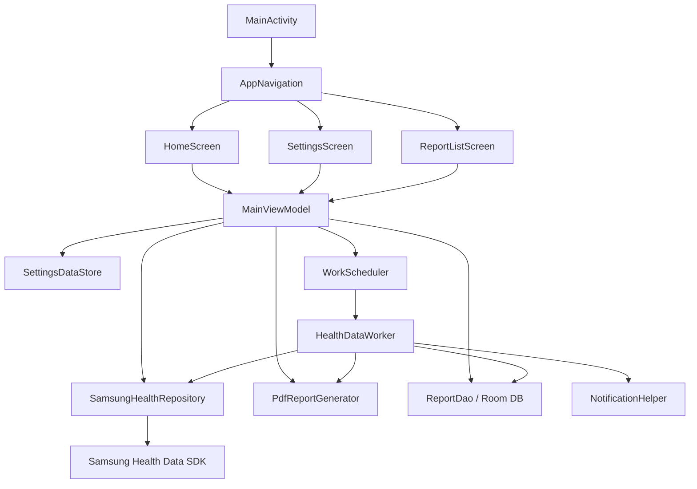

# Samsung Health Rapor Uygulaması - Proje Özeti

## ✅ Proje Durumu: **Tamamlandı ve Derlendi**

APK başarıyla oluşturuldu:
[app-debug.apk](file:///home/steppenwolf/shealt/app/build/outputs/apk/debug/app-debug.apk)

---

## 🏛️ Mimari

Uygulama **MVVM** mimarisi kullanmaktadır. Ana bileşenler:



---

## 📁 Dosya Yapısı

### Veri Katmanı

| Dosya | Açıklama |
|-------|----------|
| [DailyHealthReport.kt](file:///home/steppenwolf/shealt/app/src/main/java/com/shealt/healthreport/data/model/DailyHealthReport.kt) | 16 farklı sağlık verisi modeli (uyku, adım, nabız, enerji, egzersiz, tansiyon, SpO2, kan şekeri, vücut kompozisyonu, beslenme, su tüketimi, kat, cilt ısısı, uyku apnesi, kullanıcı profili) |
| [SamsungHealthRepository.kt](file:///home/steppenwolf/shealt/app/src/main/java/com/shealt/healthreport/data/repository/SamsungHealthRepository.kt) | Samsung Health SDK ile veri çekme (uyku, adım, nabız, enerji, egzersiz) |
| [HealthPermissionManager.kt](file:///home/steppenwolf/shealt/app/src/main/java/com/shealt/healthreport/data/repository/HealthPermissionManager.kt) | SDK izin yönetimi |

### Yerel Depolama

| Dosya | Açıklama |
|-------|----------|
| [AppDatabase.kt](file:///home/steppenwolf/shealt/app/src/main/java/com/shealt/healthreport/data/local/AppDatabase.kt) | Room veritabanı sınıfı |
| [ReportEntity.kt](file:///home/steppenwolf/shealt/app/src/main/java/com/shealt/healthreport/data/local/ReportEntity.kt) | Rapor veri tablosu (tarih, dosya yolu, adım, uyku skoru, enerji, nabız, egzersiz sayısı) |
| [ReportDao.kt](file:///home/steppenwolf/shealt/app/src/main/java/com/shealt/healthreport/data/local/ReportDao.kt) | Veritabanı sorguları (ekleme, listeleme, silme) |
| [SettingsDataStore.kt](file:///home/steppenwolf/shealt/app/src/main/java/com/shealt/healthreport/data/local/SettingsDataStore.kt) | Kullanıcı ayarları (saat, otomatik rapor) |

### PDF Motoru

| Dosya | Açıklama |
|-------|----------|
| [PdfReportGenerator.kt](file:///home/steppenwolf/shealt/app/src/main/java/com/shealt/healthreport/pdf/PdfReportGenerator.kt) | A4 boyutunda PDF oluşturma, Canvas API ile çizim (başlık, adım, nabız, uyku, enerji, egzersiz bölümleri) |

### Arka Plan İşlemleri

| Dosya | Açıklama |
|-------|----------|
| [HealthDataWorker.kt](file:///home/steppenwolf/shealt/app/src/main/java/com/shealt/healthreport/worker/HealthDataWorker.kt) | WorkManager ile günlük arka plan rapor oluşturma |
| [WorkScheduler.kt](file:///home/steppenwolf/shealt/app/src/main/java/com/shealt/healthreport/worker/WorkScheduler.kt) | Günlük zamanlama (kullanıcının seçtiği saatte) |
| [NotificationHelper.kt](file:///home/steppenwolf/shealt/app/src/main/java/com/shealt/healthreport/worker/NotificationHelper.kt) | Rapor hazır bildirim sistemi (tıklayınca PDF açılır) |

### Kullanıcı Arayüzü (Jetpack Compose)

| Dosya | Açıklama |
|-------|----------|
| [Theme.kt](file:///home/steppenwolf/shealt/app/src/main/java/com/shealt/healthreport/ui/theme/Theme.kt) | Material 3 koyu tema |
| [HomeScreen.kt](file:///home/steppenwolf/shealt/app/src/main/java/com/shealt/healthreport/ui/screens/HomeScreen.kt) | Ana sayfa (izin kontrolü + manuel rapor oluşturma butonu) |
| [SettingsScreen.kt](file:///home/steppenwolf/shealt/app/src/main/java/com/shealt/healthreport/ui/screens/SettingsScreen.kt) | Ayarlar (otomatik rapor switch, saat seçici dialog) |
| [ReportListScreen.kt](file:///home/steppenwolf/shealt/app/src/main/java/com/shealt/healthreport/ui/screens/ReportListScreen.kt) | Geçmiş raporlar listesi (tıklayınca PDF açılır) |
| [AppNavigation.kt](file:///home/steppenwolf/shealt/app/src/main/java/com/shealt/healthreport/ui/navigation/AppNavigation.kt) | Alt navigasyon çubuğu (Ana Sayfa, Raporlar, Ayarlar) |
| [MainViewModel.kt](file:///home/steppenwolf/shealt/app/src/main/java/com/shealt/healthreport/ui/viewmodels/MainViewModel.kt) | Ana ViewModel (izin, rapor oluşturma, ayarlar, zamanlama) |

### Bağımlılık Enjeksiyonu & Konfigürasyon

| Dosya | Açıklama |
|-------|----------|
| [AppModule.kt](file:///home/steppenwolf/shealt/app/src/main/java/com/shealt/healthreport/di/AppModule.kt) | Hilt DI modülü (HealthDataStore, Room, DataStore sağlayıcıları) |
| [HealthReportApp.kt](file:///home/steppenwolf/shealt/app/src/main/java/com/shealt/healthreport/HealthReportApp.kt) | Application sınıfı (Hilt + WorkManager konfigürasyonu) |
| [MainActivity.kt](file:///home/steppenwolf/shealt/app/src/main/java/com/shealt/healthreport/MainActivity.kt) | Ana activity (Compose entry point) |
| [AndroidManifest.xml](file:///home/steppenwolf/shealt/app/src/main/AndroidManifest.xml) | Manifest (FileProvider, WorkManager, bildirim izinleri) |

---

## 🔧 Derleme Doğrulaması

```
BUILD SUCCESSFUL in 1s
42 actionable tasks: 42 up-to-date
```

> [!TIP]
> APK dosyası şu konumda:
> `/home/steppenwolf/shealt/app/build/outputs/apk/debug/app-debug.apk`

---

## 📱 Cihaza Yükleme

Samsung cihazınıza yüklemek için:

```bash
# USB üzerinden ADB ile
adb install app/build/outputs/apk/debug/app-debug.apk
```

Veya APK dosyasını cihazınıza kopyalayıp dosya yöneticisinden açabilirsiniz.

---

## ⚙️ Uygulama Özellikleri

1. **Samsung Health Veri Çekme**: Uyku, adım, nabız, enerji skoru, egzersiz verileri
2. **PDF Rapor**: A4 boyutunda detaylı sağlık raporu, Documents/HealthReports klasörüne kaydedilir
3. **Otomatik Zamanlama**: WorkManager ile günlük belirlenen saatte otomatik rapor
4. **Bildirimler**: Rapor hazır olduğunda bildirim, tıklayınca PDF açılır
5. **Koyu Tema**: Material 3 koyu tema UI
6. **Geçmiş Raporlar**: Room DB'de saklanan raporları listeleme ve açma

> [!IMPORTANT]
> Uygulama **Samsung cihazında** ve **Samsung Health uygulaması yüklü** olarak çalışır. İlk açılışta Samsung Health izinlerini vermeniz gerekecektir.
